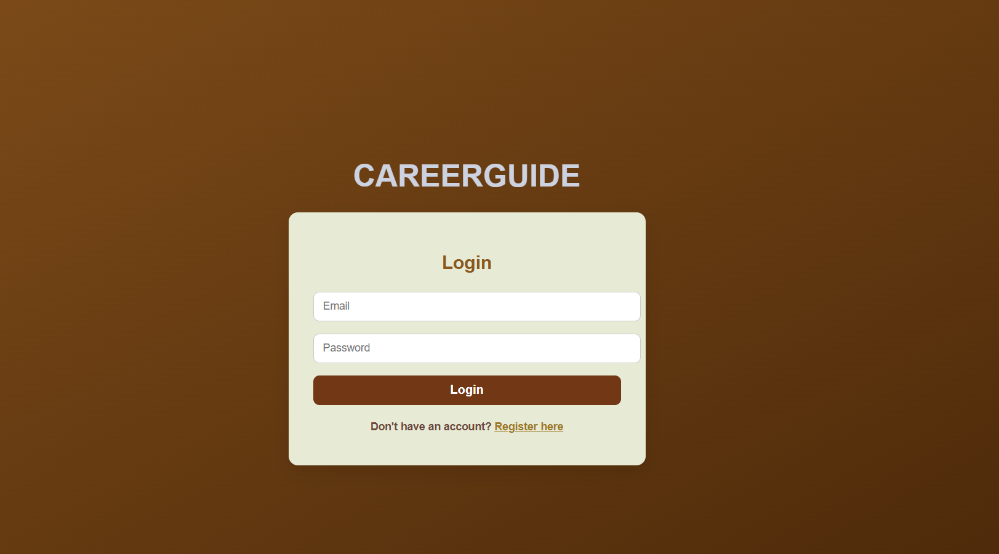
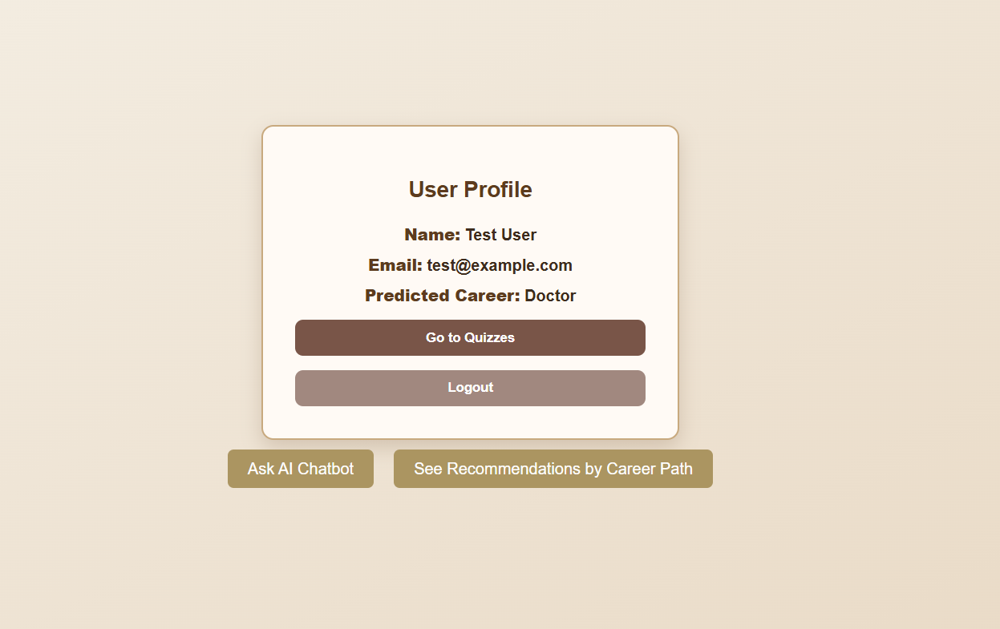
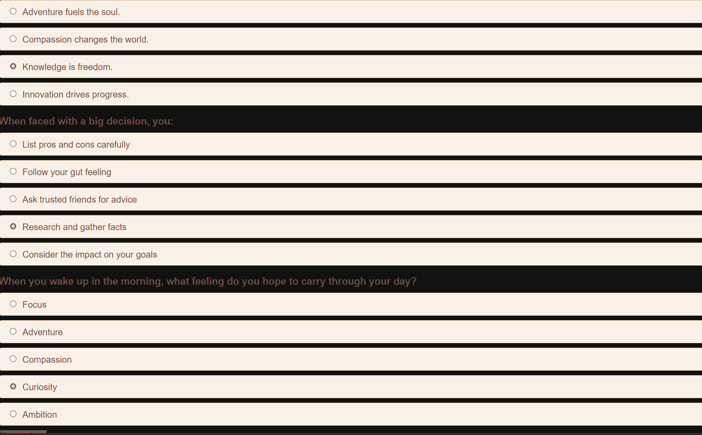
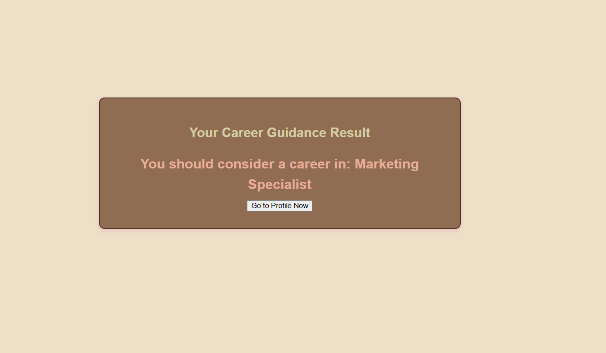
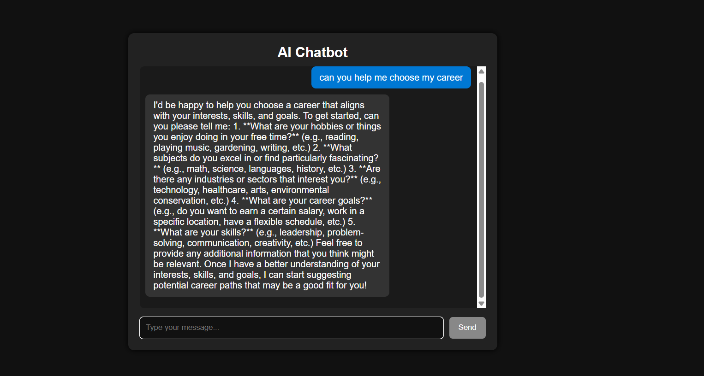

# CareerGuide 🎓

CareerGuide is a full-stack web application designed to help students and young professionals discover the best career paths based on their interests, strengths, and skills. The platform uses a combination of quiz-based assessments and AI/ML models to offer personalized recommendations.

---

## 🚀 Features

- 🔐 User Authentication (Register & Login)
- 📄 Profile Management
- 📊 Career Quiz with 18 questions
- 🧠 AI-based career path predictions
- 💬 Chatbot for guidance and Q&A
- 🎯 Personalized dashboard for insights

---

## 🛠️ Tech Stack

**Frontend**:  
- React.js   

**Backend**:  
- Node.js  
- Express.js  
- MongoDB  

**Machine Learning**:  
- Python  
- Scikit-learn / Pandas / Numpy  


**AI Chatbot**  
- Groq API (running Mistral or LLaMA model)  
- Natural Language Processing (NLP)

**Other Tools**:  
- JWT Authentication  
- Git & GitHub  
---
## 🖼️ Screenshots

### 🏠 Home Page  


---

### 👤 Profile Page  


---

### 📝 Quiz Page  


---

### 🎯 Result Page  


---

### 🤖 Chatbot Page  


---

### 🛣️ Career Path Page  


## 📦 Installation

```bash
# Clone the repository
git clone https://github.com/ibj21/careerguide.git
cd careerguide

# Install backend dependencies
cd server
npm install

# Install frontend dependencies
cd ../client
npm install
